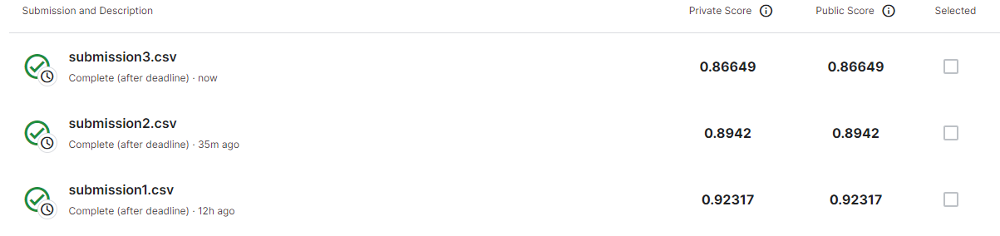
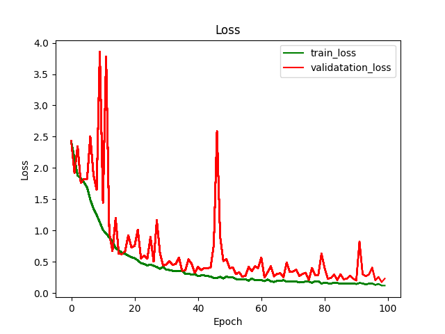

# Plant-Seedlings-Classification
Lab practice : https://www.kaggle.com/competitions/plant-seedlings-classification/overview

## Environment
Python version : 3.11.4

GPU : NVIDIA GeForce GTX 1080 Ti

## Abstract
We use **Resnet50** in **torchvision.models** to train a model which can help classifying plant seeds, so as to do transfer learning with fc layer and model weights.

## Processing:
### Code execution:
(Data need to download additionally, I don't put in the folder)

python3 train.py

python3 test.py
### Steps of training:
1. Created training dataset and testing dataset in `datasets.py`, then loaded into dataloader for model, the training set had been split into 4:1 for training and validation set.
2. Then trained the model in `train.py`, the hyper-parameter was set as {epoch=100, batch size=32, learning rate=0.002,

   
    fc_layer = nn.Sequential(
        nn.Linear(model.fc.in_features, 12),
        
    ) }.

   And counted training accuracy/error and loss accuracy/error, the plot them with `utils/save_plot.py`'s function **save_acc** and **save_loss**.

3. Finally, the data had been tested in `test.py` with the model that was trained which loading `trained_model_weight.pth`, `utils/save_model.py` can help store the weight of model.

   Then generate `submission.csv` in order to submit Kaggle.

## Score on Kaggle :

submission 1/2/3 corresponded to 

nn.Sequential(nn.Linear(model.fc.in_features,12)),

nn.Sequential(nn.Linear(model.fc.in_features, 1024), nn.ReLU(), nn.Linear(1024, 12)) ,

nn.Sequential(nn.Linear(model.fc.in_features, 1024), nn.ReLU(), nn.Dropout(0.5), nn.Linear(1024, 12)), respectively.

We can see the less nn element we add, the higher of the score.

   

## Training loss and training accuracy:
- In nn.Sequential(nn.Linear(model.fc.in_features,12))

- In nn.Sequential(nn.Linear(model.fc.in_features, 1024), nn.ReLU(), nn.Linear(1024, 12)) ,

- In nn.Sequential(nn.Linear(model.fc.in_features, 1024), nn.ReLU(), nn.Dropout(0.5), nn.Linear(1024, 12))

## Reference
https://pytorch.org/docs/stable/notes/broadcasting.html
https://hackmd.io/@ccumvllab/pytorch_2_0_1#%E5%9B%BA%E5%AE%9A%E6%A8%A1%E5%9E%8B%E5%8F%83%E6%95%B8
https://ithelp.ithome.com.tw/articles/10279642
https://www.learncodewithmike.com/2020/11/python-pandas-dataframe-tutorial.html
https://ithelp.ithome.com.tw/articles/10226578
https://docs.python.org/zh-tw/3/library/os.path.html
https://medium.com/@yuhsuan_chou/python-%E5%9F%BA%E7%A4%8E%E8%B3%87%E6%96%99%E8%A6%96%E8%A6%BA%E5%8C%96-matplotlib-401da7d14e04
https://www.cnblogs.com/poloyy/p/12526592.html
https://blog.csdn.net/weixin_37226516/article/details/62042550
https://blog.csdn.net/ChaoMartin/article/details/118686268
https://markdown.tw/
https://pytorch.org/vision/stable/models.html
https://blog.csdn.net/hgnuxc_1993/article/details/120641681
https://zhuanlan.zhihu.com/p/165219346
https://clay-atlas.com/blog/2019/11/11/python-chinese-tutorial-tqdm-progress-and-ourself/
